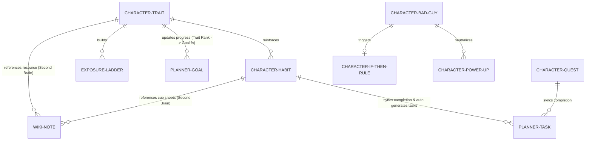

# Character Development System Refactoring Plan

This document outlines the audit findings and the refactoring plan to convert the existing Character section in Nova OS into a fully editable, database-driven, and planner-integrated personal development module.

---

## 1. Executive Summary & Audit Findings

Nova OS contains a rich, game-designed Character Development Engine featuring Traits, Habits, Quests, Exposure Ladders, Bad Guys, If-Then Rules, Accountability Contracts, Reflections, and Seasons. 

However, during our inspection, we identified several critical gaps:
1. **Un-editable Entities**: Habits, Quests, Bad Guys, Exposure Ladders, If-Then Rules, and Accountability Contracts are static once created. Editing is either missing entirely or restricted to a simple browser `prompt()` updating only the title.
2. **Template-Only Constraints**: Bad Guys and Exposure Ladders can only be added from pre-defined templates or AI suggestions. There is no UI for custom creation from scratch.
3. **Unidirectional Planner Syncing**: While completing a character habit or quest can auto-complete a linked task in the Planner, completing a linked task in the Planner does not trigger the completion of the character habit/quest (unidirectional synchronization).
4. **Isolated Memory System**: Reflections are created as database rows in `character_reflections`, and local logs are pushed to `addMemoryItem` in `AppContext` (saved under `nova_user_docs`). However, there is no UI to manually link WikiNotes or Second Brain resources to traits, habits, or exposure ladders.
5. **No Visual CRUD for Traits**: Default traits are hardcoded during onboarding. Users cannot create custom traits or edit descriptions in the UI.

---

## 2. Current vs. Proposed Architecture

### Current Data Storage Model
Currently, Nova OS uses a split storage model:
* **Planner, Notes (Second Brain), Projects**: Stored in the generic, schema-less `public.nova_user_docs` table as JSON payloads, batch-written via `AppContext.tsx`.
* **Character Feature**: Stored in 13+ dedicated relational tables (`character_profiles`, `character_traits`, `character_habits`, etc.) with server-side PL/pgSQL database triggers and RPC functions (`award_character_xp`, `complete_character_habit`, etc.).

### Architecture Decision
**We will retain the relational tables for the Character module.** 
* *Rationale*: The database level is heavily utilized for gamification logic (e.g. streaks, XP formulas, level-up checks, trigger audits) written directly in SQL/PG. Rebuilding these as schema-less JSON documents would require rewriting all PL/pgSQL triggers and RPC procedures.
* *Strategy*: We will implement rich edit/create dialogs, wire up backend update calls, and enforce bidirectional bridging with the schema-less Planner and Brain.

---

## 3. Proposed Entity Relationships & Integrations

The refactored Character system will connect directly with existing Planner and Brain modules:

### Bridging Logic Specs
1. **Bidirectional Planner Task Sync**:
   * When a task is added/updated in the planner, if it contains the tag `character:habit:<habit_id>` or `character:quest:<quest_id>`, completing/reverting that task in the Planner will trigger an RPC call on the backend (`complete_character_habit` or `complete_character_quest`) to update streaks, ranks, and XP.
2. **Trait-to-Goal Sync**:
   * Linking a Trait to a Quarterly/Monthly Goal via `CharacterGoalIntegration` will calculate goal completion based on trait rank (e.g., `progress = Math.min(100, current_rank * 10)`).
3. **Second Brain Resources**:
   * Allow notes in the Second Brain to be referenced inside Traits, Habits, Quests, or Ladders. We will store these relationships under a new property `linkedNoteIds` in `payload` of `nova_user_docs` or inside a linking table, allowing users to read supporting materials directly on the Character view.

---

## 4. UI/Page Structure Refactoring

The Character system will maintain its single-page, tabbed layout in `src/features/character/Character.tsx` but will implement full CRUD overlays:

| Module Tab | Current Status | Refactor Target |
| :--- | :--- | :--- |
| **Character Overview** | Active widgets & stats. | *Retain*. Add a feed displaying the recent events from `character_activity_logs`. |
| **Active Habits** | List & Cards. Simple prompt edit. | Add **EditHabitModal** with fields: Cue, Response, Reward XP, Difficulty, Frequency, Trait Link, and Schedule. Add "Archive" button. |
| **Bad Guys** | Templates only. No edit. | Add **CreateBadGuyForm** and **EditBadGuyModal** with fields: Title, Triggers, Warning Signs, Consequences, and If-Then Rule Link. |
| **Exposure Ladders** | Template only. Step list. | Add **EditLadderModal** allowing custom ladder names. Add **ManageStepsModal** to add custom steps, drag/reorder steps, and set custom repetition targets. |
| **Quests & Bosses** | Standard creation, no editing. | Add **EditQuestModal** to allow editing quest title, description, why it matters, checklists, and reward XP. |
| **Rules & Contracts** | Create/Delete. No editing. | Add **EditRuleModal** and **EditContractModal** supporting all v2 schema fields. |
| **Traits** | Static list. Prompt rename. | Add **CreateTraitModal** and **EditTraitModal** allowing custom traits (custom icons, target scores, and descriptions). |

---

## 5. Files to Create/Modify

### [NEW]
* [character-system-refactor.md](file:///C:/Users/Mo0oT/.gemini/antigravity-ide/scratch/nova-os/docs/character-system-refactor.md) — This document.

### [MODIFY]
* [useCharacter.ts](file:///C:/Users/Mo0oT/.gemini/antigravity-ide/scratch/nova-os/src/features/character/hooks/useCharacter.ts)
  * Pass and implement: `onUpdateQuest`, `onUpdateLadder`, `onUpdateBadGuy`, `onUpdateContract`, `onUpdateRule`.
  * Hook into planner change events in `AppContext` to complete a habit or quest when the corresponding planner task is marked complete in the UI.
* [HabitsView.tsx](file:///C:/Users/Mo0oT/.gemini/antigravity-ide/scratch/nova-os/src/features/character/views/HabitsView.tsx)
  * Replace the inline title `prompt` with a full edit dialog.
* [QuestsView.tsx](file:///C:/Users/Mo0oT/.gemini/antigravity-ide/scratch/nova-os/src/features/character/views/QuestsView.tsx)
  * Add edit button and wire up the `onUpdateQuest` callback.
* [BadGuysView.tsx](file:///C:/Users/Mo0oT/.gemini/antigravity-ide/scratch/nova-os/src/features/character/views/BadGuysView.tsx)
  * Add a form for creating custom bad guys. Add edit modals.
* [IfThenRulesView.tsx](file:///C:/Users/Mo0oT/.gemini/antigravity-ide/scratch/nova-os/src/features/character/views/IfThenRulesView.tsx)
  * Add an edit rule dialog.
* [AccountabilityView.tsx](file:///C:/Users/Mo0oT/.gemini/antigravity-ide/scratch/nova-os/src/features/character/views/AccountabilityView.tsx)
  * Add an edit contract dialog.
* [ExposureLaddersView.tsx](file:///C:/Users/Mo0oT/.gemini/antigravity-ide/scratch/nova-os/src/features/character/views/ExposureLaddersView.tsx)
  * Add buttons to edit the ladder metadata and manage individual steps (add step, edit step title, reorder step_order).
* [TraitsView.tsx](file:///C:/Users/Mo0oT/.gemini/antigravity-ide/scratch/nova-os/src/features/character/views/TraitsView.tsx)
  * Replace default-only selection with a custom trait creation form. Add description editing.
* [AppContext.tsx](file:///C:/Users/Mo0oT/.gemini/antigravity-ide/scratch/nova-os/src/context/AppContext.tsx)
  * When `updatePlannerTask` is executed, check if the task has a character-related tag and update the character state.

---

## 6. Verification and Migration Strategy

### Data Migration Strategy
* No database migrations are required for the tables as the v2 schemas already support all the fields in the types.
* RLS policies are already enabled, ensuring secure access.
* For default values, new custom entities will be inserted with standard UUIDs.

### Automated Tests
* Run `npm test` to ensure all existing character test suites pass cleanly.
* Implement additional tests for updated hook logic in `useCharacter.test.ts`.

---

## 7. Recommended Implementation Sequence

1. **Step 1: Wire Up Hook Callbacks**
   * Update `useCharacter.ts` to implement and export the `update...` services for all entity types.
2. **Step 2: Custom Creation & Edit Modals**
   * Refactor the Views (`HabitsView`, `QuestsView`, `BadGuysView`, `IfThenRulesView`, `AccountabilityView`, `ExposureLaddersView`, `TraitsView`) to support visual CRUD operations.
3. **Step 3: Bidirectional Syncing**
   * Implement event triggers in `AppContext` and `useCharacter` to synchronize task completions bidirectionally.
4. **Step 4: Wiki Note Linking**
   * Add a note picker dialog in the Character Integrations tab to link WikiNotes as reference resources.
5. **Step 5: Activity Log Feed**
   * Build a lightweight event feed on the Overview Dashboard reading from the `character_activity_logs` table.
